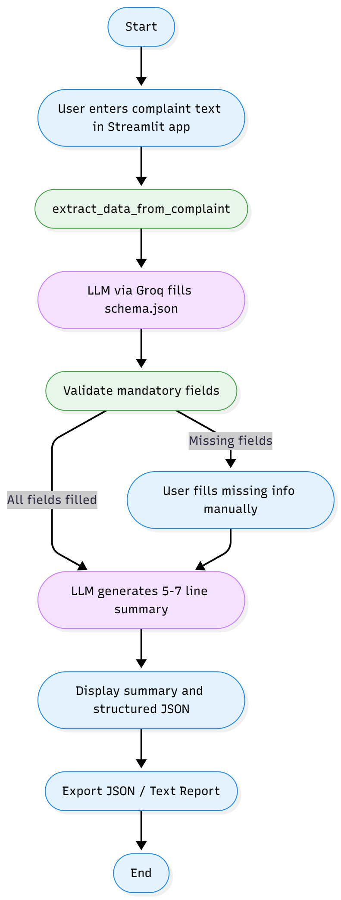

# schema-based-summarizer
This repo implements the project that summarizes the given complaint text based on the schema, when complaint is given LLM finds the given information is sufficient or not, if it isn't it asks the user to enter the mandatory fields and then summarizes it based on the predefined schema.


# FIR Auto-Fill System v1.1

An intelligent Streamlit application in which the system extracts structured data from complaint texts using Groq's LLaMA 3.1 model, validates mandatory information, and generates concise summaries for police officers.

## 🚀 Features

- **Automated Data Extraction**: Uses LLaMA 3.1 8B Instant model via Groq API to extract structured information from unstructured complaint texts
- **Smart Validation**: Automatically identifies and prompts for missing mandatory fields
- **Interactive Form Filling**: Dynamic forms for collecting missing essential information
- **Concise Summary Generation**: Creates writer-friendly 5-7 line summaries for quick understanding
- **Structured Data Output**: Generates validated JSON following FIR-AUTO-1.1 schema
- **Export Capabilities**: Download structured data as JSON or complete reports

## 🚀 Project Workflow

Below is the end-to-end workflow of the system:

<p align="center">
  
</p>


## 📋 Prerequisites

- Python 3.8 or higher
- Groq API key (get it from [Groq Console](https://console.groq.com/keys))

## 🛠️ Installation

1. **Clone or download the project files**

2. **Install required dependencies:**
```bash
pip install -r requirements.txt
```

3. **Set up your Groq API key:**
   - Copy `.env.example` to `.env`
   - Replace `your-groq-api-key-here` with your actual Groq API key

```bash
cp .env.example .env
# Edit .env and add your API key
```

## 🎯 Usage

1. **Start the Streamlit app:**
```bash
streamlit run app.py
```

2. **Access the application:**
   - Open your browser and go to `http://localhost:8501`

3. **Process a complaint:**
   - Enter or paste complaint text (or use the sample complaint)
   - Click "Extract & Process" to extract structured data
   - Fill in any missing mandatory fields when prompted
   - Review the generated summary and structured data
   - Export the results as JSON or text report

## 📂 Project Structure

```
fir-auto-fill/
│
├── app.py              # Main Streamlit application
├── schema.json         # FIR-AUTO-1.1 schema definition
├── utils.py            # Helper functions and utilities
├── requirements.txt    # Python dependencies
├── .env.example        # Environment variables template
├── .env               # Your API key (create from .env.example)
└── README.md          # This file
```

## 🔧 Configuration

### Mandatory Fields
The system validates these essential fields:
- Complainant name
- Complainant address
- Phone number
- Incident location
- Incident date
- Offense type
- Offense description

### Schema Structure (FIR-AUTO-1.1)
The application uses a comprehensive schema that includes:
- Complaint metadata
- Complainant information
- Victim details
- Accused information
- Incident details
- Offense specifications
- Loss/damage assessment
- Witness information
- Evidence availability
- Digital footprint
- Reporting delays

## 🎨 Customization

### Modifying Mandatory Fields
Edit the `MANDATORY_FIELDS` dictionary in `app.py`:

```python
MANDATORY_FIELDS = {
    "complainant.name": "Complainant Name",
    "complainant.address": "Complainant Address",
    # Add or remove fields as needed
}
```

### Adjusting LLM Parameters
Modify the Groq API call parameters in `extract_data_from_complaint()` and `generate_summary()` functions:

```python
response = groq_client.chat.completions.create(
    model="llama-3.1-8b-instant",  # Model selection
    temperature=0.1,                # Creativity level (0-1)
    max_tokens=2000                 # Response length limit
)
```

## 🔍 Utility Functions

The `utils.py` file provides additional helper classes:

- **FIRValidator**: Validates phone numbers, dates, and times
- **TextProcessor**: Extracts dates, times, phone numbers, amounts, and offense keywords from text
- **DataFormatter**: Formats data for display and generates FIR numbers
- **PromptTemplates**: Manages LLM prompt templates

## 🚨 Troubleshooting

### Common Issues

1. **API Key Error**: Ensure your Groq API key is correctly set in the `.env` file

2. **JSON Parsing Error**: The LLM might return improperly formatted JSON. The app includes error handling to manage this.

3. **Missing Dependencies**: Run `pip install -r requirements.txt` to install all required packages

4. **Streamlit Port Issues**: If port 8501 is busy, Streamlit will automatically try the next available port

## 📈 Future Enhancements

Planned features for future versions:
- OCR integration for scanned document processing
- Multi-language support
- Database integration for FIR storage
- Advanced analytics and reporting
- Batch processing capabilities
- Integration with police station management systems

## 📝 Sample Complaint Text

```
I am Rajesh Kumar, residing at 45 MG Road, Bengaluru. My phone number is 9876543210.

On 15th January 2025 at around 8:30 PM, I was walking near the City Market area when two unknown persons on a motorcycle snatched my gold chain worth Rs. 50,000. They threatened me with a knife and fled towards the railway station. I sustained minor injuries on my neck. There were 2-3 people nearby who witnessed the incident.
```

## 🤝 Contributing

Feel free to submit issues, fork the repository, and create pull requests for any improvements.

## 📜 License

This project is open source and available for educational and non-commercial use.

## 🙏 Acknowledgments

- Powered by Groq API and LLaMA 3.1 8B Instant model
- Built with Streamlit for the web interface
- Schema design based on standard FIR requirements

---

For questions or support, please open an issue in the project repository.